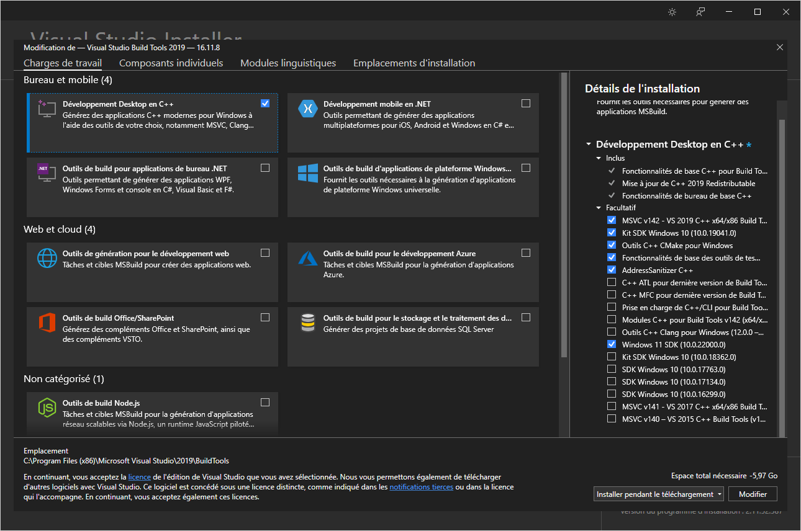

# Rust playground

This repository contains notes about the Rust programming language.

# Installation notes

Download the installer from [https://www.rust-lang.org/tools/install](https://www.rust-lang.org/tools/install).

##  Notes for Windows

You need to install Visual Studio [here](https://visualstudio.microsoft.com/visual-cpp-build-tools/).
This will install the build tools (the linker...).

Installer configuration:

By default, the build tools should be installed within the following directory:

`C:\Program Files (x86)\Microsoft Visual Studio\2019\BuildTools\VC\Tools\MSVC\14.29.30133\bin\Hostx64\x64`

> Please note that the actual path may be different depending on the version of Visual Studio installed on your system.
>
> Find the exact directory path (Powershell):
> 
> `Get-Childitem –Path "C:\Program Files (x86)\Microsoft Visual Studio" -Include link.exe -File -Recurse`

Thus, you need to make sure that this path is added to the `PATH` environment variable:

* **Powershell**: `Write-Host $Env:PATH`
* **Dos**: `echo %PATH%`

Make sure that you can execute the linker: execute the command `link` (from the Powershell or Dos console).

