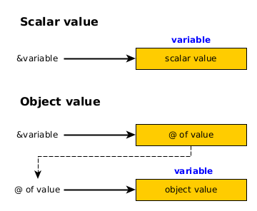
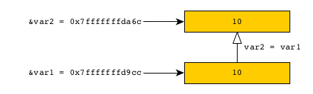
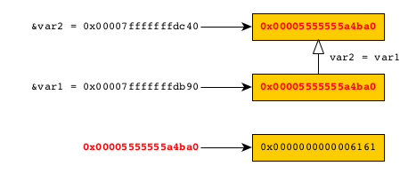

# Variables and references

## Definition

* **Variable**: a variable is an alias for a value. It designates a value. 
* **Reference**:   
  * For a scalar value (stored in the stack), a reference to a variable is the address of the memory location that
    contains the value.
  * For an object value (stored in the heap), a reference to a variable is the address of the memory location that
    contains the address (in the heap) where the value is stored.

> **Watch out**
>
> A variable **always** designates a value. However, a _reference_ (to a variable) does not refer to the same thing
> depending on the nature of the value! For a scalar value, it refers to the memory location used to store the value
> (in the stack). For an object value, it refers to the memory location that contains the address of the memory
> location where the value is stored (in the heap).
> 
> 

## Illustration in practice

### Stack storage (scalar value)

Let's consider this Rust code:

```bash
$ cat -n src/main.rs
1   fn main() {
2       let var1: u32 = 10;
3       println!("var1: \"{}\" ({:p})", var1, &var1);
4       println!("The end");
5   }
```

We use GDB to look at the process memory. We set a breakpoint at line 4, and then we look at the content of the memory.

```bash
$ gdb target/debug/memory-management 
...
(gdb) b 4
Breakpoint 1 at 0x8b36: file src/main.rs, line 4.
(gdb) r
Starting program: /home/denis/Documents/github/rust-playground/memory-management/target/debug/memory-management 
[Thread debugging using libthread_db enabled]
Using host libthread_db library "/lib/x86_64-linux-gnu/libthread_db.so.1".
var1: "10" (0x7fffffffdc84)

Breakpoint 1, memory_management::main () at src/main.rs:4
4	       println!("The end");
(gdb) x /wd 0x7fffffffdc84
0x7fffffffdc84:	10
```

`&var1` = `0x7fffffffdc84` -> `10`


### Heap allocation

Let's consider this Rust code:

```bash
$ cat -n src/main.rs 
1   fn main() {
2       let var1: String = String::from("aa");
3       println!("var1: \"{}\" ({:p})", var1, &var1);
4       println!("The end");
5   }
```

We use GDB to look at the process memory. We set a breakpoint at line 4, and then we look at the content of the memory.

```bash
branch: [master]$ gdb target/debug/memory-management 
...
(gdb) b 4
Breakpoint 1 at 0xa45f: file src/main.rs, line 4.
(gdb) r
Starting program: /home/denis/Documents/github/rust-playground/memory-management/target/debug/memory-management 
[Thread debugging using libthread_db enabled]
Using host libthread_db library "/lib/x86_64-linux-gnu/libthread_db.so.1".
var1: "aa" (0x7fffffffdc60)

Breakpoint 1, memory_management::main () at src/main.rs:4
4	       println!("The end");
(gdb) x/gx 0x7fffffffdc60
0x7fffffffdc60:	0x00005555555a4ba0
(gdb) x/wx 0x00005555555a4ba0
0x5555555a4ba0:	0x00006161
```

We can see that:

* The value of `&var1` is `0x7fffffffdc60`.
* The content of the memory at the address `0x7fffffffdc60` is `0x00005555555a4ba0`.
* And the content of the memory at the address `0x00005555555a4ba0` is `0x0000000000006161`.
  You recognize the string `"aa"` (see the [UTF-8 encoding table and Unicode characters](https://www.charset.org/utf-8)).

In summary:

`&var1` = `0x00007fffffffdcb0` -> `0x00005555555a4ba0` -> "`aa`"


## Assignment and ownership

### Stack storage: no tacking of ownership 

Let's consider this Rust [code](src/mm1.rs):

```bash
$ cat -n src/main.rs
1	fn main() {
2	    let var1 = 10;
3	    println!("var1: \"{}\" ({:p})", var1, &var1);
4	    println!("Pause");
5	    let var2 = var1;
6	    println!("var2: \"{}\" ({:p})", var2, &var2);
7	    println!("The end");
8	}
```

We use GDB to look at the process memory. We set breakpoints at lines 4 and 7, and then we look at the content of the memory.

```bash
$ gdb target/debug/memory-management
...
(gdb) b 4
Breakpoint 1 at 0x7fa2: file src/main.rs, line 4.
(gdb) b 7
Breakpoint 2 at 0x80cf: file src/main.rs, line 7.
(gdb) r
Starting program: /home/denis/Documents/github/rust-playground/memory-management/target/debug/memory-management 
[Thread debugging using libthread_db enabled]
Using host libthread_db library "/lib/x86_64-linux-gnu/libthread_db.so.1".
var1: "10" (0x7fffffffd9cc)

Breakpoint 1, memory_management::main () at src/main.rs:4
4           println!("Pause");
(gdb) x/xd 0x7fffffffd9cc
0x7fffffffd9cc: 10
(gdb) c
Continuing.
Pause
var2: "10" (0x7fffffffda6c)

Breakpoint 2, memory_management::main () at src/main.rs:7
7           println!("The end");
(gdb) x/xd 0x7fffffffda6c
0x7fffffffda6c: 10
(gdb) 

```

The value of `var1` is just assigned to `var2`. Each variable keeps its own copy of the value.
**In other words: `var2` does not take ownership of `var1` value.** 

> If you try to use the value `var1` below the line number `5`, then it is perfectly fine!



### Heap allocation: taking of ownership

Let's consider this Rust [code](src/mm2.rs):

```bash
$ cat -n src/main.rs
1	fn main() {
2	    let var1 = String::from("aa");
3	    println!("var1: \"{}\" ({:p})", var1, &var1);
4	    println!("Pause");
5	    let var2 = var1;
6	    println!("var2: \"{}\" ({:p})", var2, &var2);
7	    println!("The end");
8	}
```

We use GDB to look at the process memory. We set breakpoints at lines 4 and 7, and then we look at the content of the memory.

```bash
$ gdb target/debug/memory-management
...
(gdb) b 4
Breakpoint 1 at 0xa479: file src/main.rs, line 4.
(gdb) b 7
Breakpoint 2 at 0xa604: file src/main.rs, line 7.
(gdb) r
Starting program: /home/denis/Documents/github/rust-playground/memory-management/target/debug/memory-management 
[Thread debugging using libthread_db enabled]
Using host libthread_db library "/lib/x86_64-linux-gnu/libthread_db.so.1".
var1: "aa" (0x7fffffffdb90)

Breakpoint 1, memory_management::main () at src/main.rs:4
4       println!("Pause");
(gdb) x/xg 0x7fffffffdb90
0x7fffffffdb90: 0x00005555555a4ba0
(gdb) x/xg 0x00005555555a4ba0
0x5555555a4ba0: 0x0000000000006161
(gdb) c
Continuing.
Pause
var2: "aa" (0x7fffffffdc40)

Breakpoint 2, memory_management::main () at src/main.rs:7
7       println!("The end");
(gdb) x/xg 0x7fffffffdc40
0x7fffffffdc40: 0x00005555555a4ba0
(gdb) x/xg 0x00005555555a4ba0
0x5555555a4ba0: 0x0000000000006161
(gdb) x/xg 0x7fffffffdb90
0x7fffffffdb90: 0x00005555555a4ba0
(gdb) print var1
$1 = alloc::string::String {vec: alloc::vec::Vec<u8, alloc::alloc::Global> {buf: alloc::raw_vec::RawVec<u8, alloc::alloc::Global> {ptr: core::ptr::unique::Unique<u8> {pointer: 0x5555555a4ba0, _marker: core::marker::PhantomData<u8>}, cap: 2, alloc: alloc::alloc::Global}, len: 2}}
(gdb) print var2
$2 = alloc::string::String {vec: alloc::vec::Vec<u8, alloc::alloc::Global> {buf: alloc::raw_vec::RawVec<u8, alloc::alloc::Global> {ptr: core::ptr::unique::Unique<u8> {pointer: 0x5555555a4ba0, _marker: core::marker::PhantomData<u8>}, cap: 2, alloc: alloc::alloc::Global}, len: 2}}
```

We can see that when `var2` **takes ownership** of `var1`'s value (`"aa"`), the value's address (`0x00005555555a4ba0`) is assigned to `var2`.

> If you try to use the value `var1` below the line number `5`, then you will get an error!



## Immutability vs constant
 
* **Constants** must be assigned values that are defined at build time.
* **Immutable variables** can be assigned values that cannot be evaluated at build time.
  That is, values that can only be evaluated at runtime (such as the return of a function, for example).

## Mutability vs shadowing

If a variable is declared as being mutable, then you can assign new values to it (_as long as the values 
are of the same types_).

When you shadow a variable, you create a new variable with the same name (as the shadowed one).
The type of the new variable may be different from the previous one.

Illustration with [this code](src/shadowing.rs):

```rust
fn main() {

    // Shadowing
    let x = 12;
    println!("x={}", x);
    let x = "abc"; // Create a new variable.
    println!("x={}", x);

    // Mutability
    let mut y = 12;
    println!("y={}", y);
    y = 24; // Warning: must be the same type!
    println!("y={}", y);
}
```

## Reference to a mutable variable

Synopsys:

```rust
let mut n = 0;
fn run(x: &mut i32) { ... }
run(&mut n);
```

Illustration:

```rust
fn main() {

    fn rerun(n: &mut i32) {
        let var = *n * 2;
        println!("n: {}, var: {} (&var: {:p})", *n, var, &var);
        *n = *n+1;
    }

    let mut n = 0;
    while n < 4 { rerun(&mut n); }
}
```
