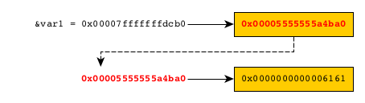

# Variables

## Memory mapping

### Stack storage

Let's consider this Rust code:

```bash
$ cat -n src/main.rs
1   fn main() {
2       let var1: u32 = 10;
3       println!("var1: \"{}\" ({:p})", var1, &var1);
4       println!("The end");
5   }
```

We use GDB to look at the process memory. We set a breakpoint at line 4, and then we look at the content of the memory.

```bash
$ gdb target/debug/memory-management 
...
(gdb) break main.rs:4
Breakpoint 1 at 0x8b36: file src/main.rs, line 4.
(gdb) r
Starting program: /home/denis/Documents/github/rust-playground/memory-management/target/debug/memory-management 
[Thread debugging using libthread_db enabled]
Using host libthread_db library "/lib/x86_64-linux-gnu/libthread_db.so.1".
var1: "10" (0x7fffffffdcd4)

Breakpoint 1, memory_management::main () at src/main.rs:4
4       println!("The end");
(gdb) x 0x7fffffffdcd4
0x7fffffffdcd4: 0x0000000a
```

`&var1` = `0x7fffffffdcd4` -> `10`


### Heap allocation

Let's consider this Rust code:

```bash
$ cat -n src/main.rs 
1   fn main() {
2       let var1: String = String::from("aa");
3       println!("var1: \"{}\" ({:p})", var1, &var1);
4       println!("The end");
5   }
```

We use GDB to look at the process memory. We set a breakpoint at line 4, and then we look at the content of the memory.

```bash
$ gdb target/debug/memory-management
...
(gdb) break main.rs:4
Breakpoint 1 at 0xa45f: file src/main.rs, line 4.
(gdb) run
Starting program: /home/denis/Documents/github/rust-playground/memory-management/target/debug/memory-management
[Thread debugging using libthread_db enabled]
Using host libthread_db library "/lib/x86_64-linux-gnu/libthread_db.so.1".
var1: "aa" (0x7fffffffdcb0)

Breakpoint 1, memory_management::main () at src/main.rs:4
4       println!("The end");
(gdb) print var1
$1 = alloc::string::String {vec: alloc::vec::Vec<u8, alloc::alloc::Global> {buf: alloc::raw_vec::RawVec<u8, alloc::alloc::Global> {ptr: core::ptr::unique::Unique<u8> {pointer: 0x5555555a4ba0, _marker: core::marker::PhantomData<u8>}, cap: 2, alloc: alloc::alloc::Global}, len: 2}}
(gdb) x 0x7fffffffdcb0
0x7fffffffdcb0: 0x00005555555a4ba0
(gdb) x 0x5555555a4ba0
0x5555555a4ba0: 0x0000000000006161
```

We can see that:

* The value of `&var1` is `0x7fffffffdcb0`.
* The content of the memory at the address `0x7fffffffdcb0` is `0x00005555555a4ba0`.
* And the content of the memory at the address `0x00005555555a4ba0` is `0x0000000000006161`.
  You recognize the string `"aa"` (see the [UTF-8 encoding table and Unicode characters](https://www.charset.org/utf-8)).

In summary:

`&var1` = `0x00007fffffffdcb0` -> `0x00005555555a4ba0` -> "`aa`"



## Immutability vs constant

* **Immutable variables** can be assigned values that cannot be evaluated at build time.
  That is, values that can only be evaluated at compile time (such as the return of a function, for example).
* **Constants** must be assigned values that are defined at build time.

## Mutability vs shadowing

If a variable is declared as being mutable, then you can assign new values to it (_as long as the values 
are of the same types_).

When you shadow a variable, you create a new variable with the same name (as the shadowed one).
The type of the new variable may be different from the previous one.

```rust
fn main() {

    // Shadowing
    let x = 12;
    println!("x={}", x);
    let x = "abc"; // Create a new variable.
    println!("x={}", x);

    // Mutability
    let mut y = 12;
    println!("y={}", y);
    y = 24; // Warning: must be the same type!
    println!("y={}", y);
}
```

